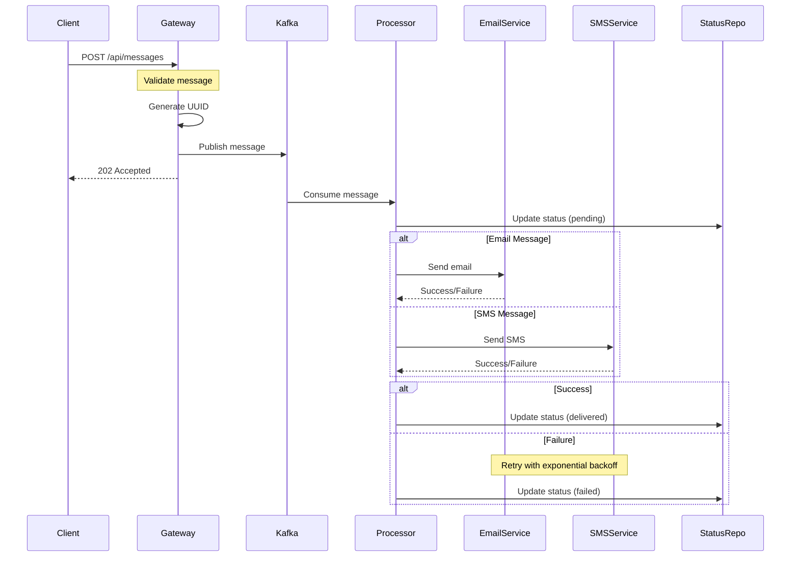

# Message Bridge Flow Diagram

## Component Responsibilities

### Gateway Service

- Validates incoming messages
- Generates unique message IDs
- Publishes to Kafka queue
- Returns immediate acknowledgment

### Message Processor

- Consumes messages from Kafka
- Routes to appropriate delivery service
- Manages message status
- Handles retries and failures

### Delivery Services

- Email Service: Handles email delivery via SMTP
- SMS Service: Handles SMS delivery via Twilio
- Both implement retry mechanism

### Status Repository

- Tracks message delivery status
- Maintains attempt counts
- Records error information
